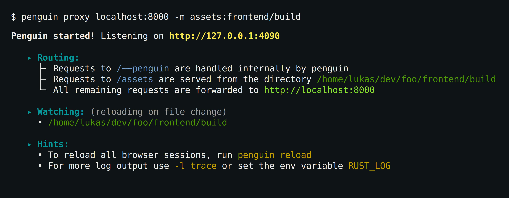

# Penguin: language and framework agnostic dev server


[](https://github.com/LukasKalbertodt/penguin/actions?query=workflow%3ACI+branch%3Amain)
[](https://crates.io/crates/penguin)
[](https://crates.io/crates/penguin)
[](https://docs.rs/penguin)

Penguin is a dev server featuring live-reloading, a file server, proxy support, and more.
It is language and framework agnostic, so it works for basically any web project.
Browser sessions can reload themselves (e.g. when a file changes) or show an overlay with a custom message (e.g. the compiler error).

Penguin is available both as a command line application (`penguin-app` on crates.io) and as a library. For for more information on the library, see [its documentation](https://docs.rs/penguin). The rest of this document will mainly talk about the CLI app.


## Installation

For now, you have to compile the app yourself. It's easiest to install it from
crates.io:

```
cargo install penguin-app
```

Don't worry about the `-app` suffix: the installed binary is called `penguin`.


## Example

<p align="center">
    </img>
</p>


- `penguin serve .` serves the current directory as file server
- `penguin proxy localhost:3000` forwards all requests to `http://localhost:3000`.
- `-m uri_path:fs_path` allows you to mount additional directories in the router.
- `penguin reload` reloads all active browser sessions.


## Versioning and stability guarantees

The app and library are versioned independently from one another. The project
mostly follows the usual semantic versioning guidelines.

- The required Rust version (MSRV) can be bumped at any time, even with minor
  releases. This will change once this project reaches 1.0.
- All UI (HTML/CSS) this app/lib produces is subject to change even with minor
  version bumps. For example, you cannot rely on a specific "directory listing"
  of the file server.
- HTTP headers in server replies might be added (or potentially even removed)
  even in minor version bumps.


## Project status and "using in production"

This project is very young and not well tested. It already serves as a useful
development tool for me. I'm interested in making it useful for as many people
as possible without increasing the project's scope too much.

I am looking for **Community Feedback**: please speak your mind in [this
issue](https://github.com/LukasKalbertodt/penguin/issues/6). Especially if you
have a use case that is not yet well served by Penguin, I'd like to know about
that.

"Can I use Penguin in production?". **No, absolutely not!** This is a
development tool only and you should not open up a Penguin server to the public.
There are probably a gazillion attack vectors.


<br />

---

## License

Licensed under either of <a href="LICENSE-APACHE">Apache License, Version
2.0</a> or <a href="LICENSE-MIT">MIT license</a> at your option.
Unless you explicitly state otherwise, any contribution intentionally submitted
for inclusion in this project by you, as defined in the Apache-2.0 license,
shall be dual licensed as above, without any additional terms or conditions.
